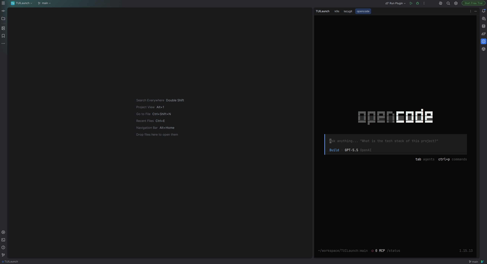
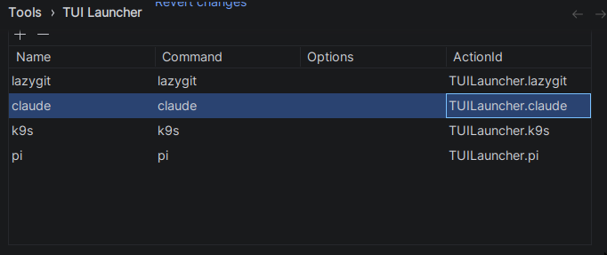
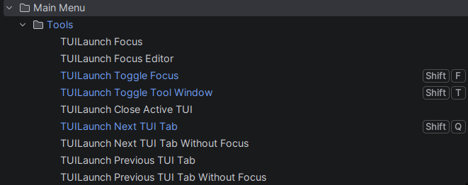
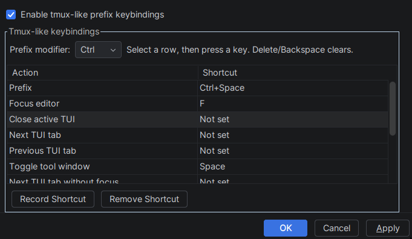
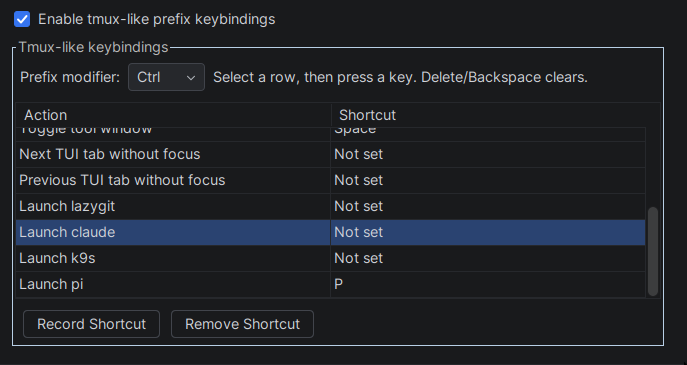

# TUILaunch


[](https://plugins.jetbrains.com/plugin/com.github.atm1020.tuilaunch)

[](https://plugins.jetbrains.com/plugin/com.github.atm1020.tuilaunch)

<!-- Plugin description -->
**TUILaunch** launches TUI applications, such as `lazygit`, inside IntelliJ-based IDEs.
It is not limited to Git tools: you can also open your favorite terminal-based agent harness,
such as `claude`, `opencode`, `pi`, etc.
Every saved launch command gets an auto-generated IDE Action, so it can be opened from the
IDE keymap, the Tools menu, or IdeaVim's `<Action>(...)` mapping.

The plugin is inspired by Neovim's [ToggleTerm plugin](https://github.com/akinsho/toggleterm.nvim?tab=readme-ov-file#custom-terminals) custom terminal feature.
<!-- Plugin description end -->

<p align="center">
  
</p>

## Features

Open the settings and add/edit commands:
<kbd>Settings/Preferences</kbd> > <kbd>Tools</kbd> > <kbd>TUI Launcher</kbd>

<p align="center">
  
</p>

### Create actions for TUI apps

Add an installed application to the table and save it. TUILaunch registers an action with the format `TUILauncher.{name}`.

Saved apps are registered automatically in the built-in IDE keymap, so you can assign normal IntelliJ shortcuts to them.

<p align="center">
  
</p>

You can also call the generated action ID from IdeaVim with `<Action>(TUILauncher.{name})`.
Running the same app action again focuses the already-open tab instead of creating a duplicate.

### Dedicated TUILaunch tool window

TUI apps open in a dedicated `TUILaunch` tool window instead of the built-in Terminal tool window.
Multiple TUI apps can stay open at the same time as separate tabs, and each tab closes automatically when its command exits.

TUILaunch remembers the last tool window size used by each app and restores it when that app tab is selected again.

### Focus and tab actions

TUILaunch registers global actions that can be bound in the IDE keymap or called from IdeaVim:

<p align="center">
  
</p>

- `TUILauncher.FocusTui` — focus the active TUI session.
- `TUILauncher.FocusEditor` — return focus to the editor.
- `TUILauncher.ToggleFocus` — switch focus between the editor and the active TUI session.
- `TUILauncher.ToggleToolWindow` — show or hide the `TUILaunch` tool window.
- `TUILauncher.ToggleToolWindowAndFocus` — show and focus the tool window, or hide it.
- `TUILauncher.CloseActiveTui` — close the selected TUI tab.
- `TUILauncher.NextTuiTab` / `TUILauncher.PreviousTuiTab` — switch TUI tabs and focus the terminal.
- `TUILauncher.NextTuiTabWithoutFocus` / `TUILauncher.PreviousTuiTabWithoutFocus` — switch TUI tabs without moving keyboard focus into the terminal.

### IdeaVim + tmux-like workflow

TUILaunch works well with both IntelliJ keymaps and IdeaVim. Standard IntelliJ keymap shortcuts continue to work while focus is inside a TUI app because the IDE handles those shortcuts first. This is enough if you rely mainly on IntelliJ keybindings.

If you mainly use IdeaVim, you can combine IdeaVim mappings in the editor with TUILaunch's tmux-like prefix shortcuts inside TUI sessions. For example, configure <kbd>Ctrl</kbd> + <kbd>Space</kbd> as the TUILaunch prefix key, then reuse familiar follow-up keys from your IdeaVim mappings.

```vim
" Launch a saved app. The action ID is TUILauncher.{name}.
nmap <Space>gg <Action>(TUILauncher.lazygit)

" Toggle focus between the editor and the active TUI tab.
nmap <Space>tt <Action>(TUILauncher.ToggleFocus)

" Focus the active TUI tab, then return to the editor.
nmap <Space>tj <Action>(TUILauncher.FocusTui)
nmap <Space>tk <Action>(TUILauncher.FocusEditor)

" Make Ctrl+Space available to IdeaVim in normal mode.
sethandler <C-Space> n:vim

" Ctrl+Space prefix-style mappings for TUILaunch.
nmap <C-Space><Space> <Action>(TUILauncher.ToggleToolWindow)
nmap <C-Space>e <Action>(TUILauncher.FocusTui)
nmap <C-Space>n <Action>(TUILauncher.NextTuiTab)
nmap <C-Space>p <Action>(TUILauncher.PreviousTuiTab)
```

Then register matching shortcuts in the TUILaunch tmux-like keybindings table, such as <kbd>Ctrl</kbd> + <kbd>Space</kbd>, then <kbd>G</kbd> to launch or focus `lazygit`.

### Tmux-like prefix keybindings

When focus is inside a TUI session, you can configure a prefix key that runs TUILaunch actions without sending the keys to the TUI app.

In the TUILaunch settings you can:

- Enable or disable tmux-like keybindings.
- Choose the prefix modifier: <kbd>Ctrl</kbd> or <kbd>Alt</kbd>.
- Record the prefix key.
- Assign prefix commands for focusing the editor, closing the active TUI, switching tabs, toggling the tool window, and launching saved apps.
- Clear assigned shortcuts with <kbd>Delete</kbd> or <kbd>Backspace</kbd>.

<p align="center">
  
</p>

Defined TUI apps automatically appear in the prefix-key table as launch actions, so they can be called from inside an active TUI session too.

> **Note:** If you update the tmux-like keybindings while TUI tabs are already open, restart those active TUILaunch tabs so the new keybindings take effect inside them.

<p align="center">
  
</p>

Example workflow after configuring <kbd>Ctrl</kbd> + <kbd>Space</kbd> as the prefix and <kbd>E</kbd> as “Focus editor”:

1. Focus a TUI tab.
2. Press <kbd>Ctrl</kbd> + <kbd>Space</kbd>.
3. Press <kbd>E</kbd>.
4. Focus returns to the editor, and the key sequence is not sent to the TUI app.

## Installation

- Using the IDE built-in plugin system:

  <kbd>Settings/Preferences</kbd> > <kbd>Plugins</kbd> > <kbd>Marketplace</kbd> > <kbd>Search for "TUILaunch"</kbd> >
  <kbd>Install</kbd>

- Using JetBrains Marketplace:

  Go to [JetBrains Marketplace](https://plugins.jetbrains.com/plugin/MARKETPLACE_ID) and install it by clicking the <kbd>Install to ...</kbd> button in case your IDE is running.

  You can also download the [latest release](https://plugins.jetbrains.com/plugin/MARKETPLACE_ID/versions) from JetBrains Marketplace and install it manually using
  <kbd>Settings/Preferences</kbd> > <kbd>Plugins</kbd> > <kbd>⚙️</kbd> > <kbd>Install plugin from disk...</kbd>

- Manually:

  Download the [latest release](https://github.com/atm1020/TUILaunch/releases/latest) and install it manually using
  <kbd>Settings/Preferences</kbd> > <kbd>Plugins</kbd> > <kbd>⚙️</kbd> > <kbd>Install plugin from disk...</kbd>

## Implementation notes

Platform behaviour this plugin depends on, collected so it does not have to be rediscovered:

- `Content.setDisplayName` fires the property change the tab UI repaints on; `setTabName` does not.
- `ToolWindowFactory.init(ToolWindow)` runs before `createToolWindowContent` and before any content exists, which is the only point where `ToolWindowEx.setTabActions` can install the tab bar's "+" button.
- A tab only gets an X and enabled "Close Tab"/"Close Other Tabs"/"Close All Tabs" actions when `Content.isCloseable` is true *and* the `<toolWindow>` element declares `canCloseContents="true"`; either one alone leaves them disabled.
- Once content is closeable the platform removes tabs without calling back into plugin code, so a `ContentManagerListener.contentRemoved` hook is the only way to learn that a session is gone.
- Register `ContentManager` listeners on the tool window's disposable, not on a tab's, or they are unhooked when the first session closes.
- `ContentManagerImpl` drops a tab from the selection *before* it fires `contentRemoved` and only picks the neighbouring tab *after*, so `contentRemoved` cannot tell whether the closed tab was the active one; `contentRemoveQuery` fires while the tab is still selected and is the only place to read that and the tool window size.
- The `ContentManager`'s `contents` array is the single source of truth for tab order and the current index; deriving order from an internal map desyncs during a close (the removal lands an event-queue turn later) and after the user drags a tab.
- Resolve the active tab *inside* the deferred block when moving the selection: reading it up front makes a burst of key presses all measure from the same pre-burst tab and advance a single step in total.
- `ToolWindowEx.stretchWidth`/`stretchHeight` are relative, so re-applying a size to a docked tool window whose selection change is already restoring it doubles the stretch and overshoots.
- Programmatic resizing emits the same `componentResized` events as a user drag, so size recording has to be suppressed while a saved size is applied and re-armed on the next event-queue pass.
- `Disposer.dispose` on an already-disposed object is a no-op, which is what lets a plugin-initiated dispose race the platform's own disposal of the `Content`.
- `JBTerminalWidget.asJediTermWidget` only unwraps the classic Gen-1 widget; that widget's `terminalStarter` is the only write path to the child process.
- JediTerm's `TerminalKeyEncoder` has no `VK_ESCAPE` entry, so `TerminalStarter.getCode(27, 0)` returns null and callers must fall back to sending the character themselves, exactly as `TerminalPanel` does.
- Sending with `userInput = true` also scrolls to the cursor and clears the selection, which is what makes a forwarded key indistinguishable from real typing.
- The platform's `TerminalEscapeKeyListener` moves focus to the editor on bare Escape in any tool window other than the bundled "Terminal", so a custom terminal window has to intercept Escape before it.
- IntelliJ delivers each `KEY_PRESSED` to a global `KeyEventDispatcher` twice; de-duplicate on (timestamp, key code) or a forwarded Escape reaches the child process twice.
- Consuming a `KEY_PRESSED` does not suppress the matching `KEY_TYPED`, which has to be swallowed separately or its character still lands in the terminal.
- `NextTab`/`PreviousTab` keystrokes differ across the default, macOS and system-shortcut keymaps, so resolve them from `ActionManager` at event time rather than hardcoding them.
- A `KeyEventDispatcher` sees one keystroke at a time and cannot arbitrate a chord, so two-stroke shortcuts must be ignored rather than matched on their first stroke.
- `ToolWindowTabRenameActionBase` hardcodes `Balloon.Position.above`, which is wrong for a bottom-anchored tool window.
- `JTable.getSelectedRow` returns -1 when nothing is selected, and `convertRowIndexToModel` passes that -1 straight through when no row sorter is installed, so an empty selection has to be rejected before the index is used.
- `ContentLayout.shouldShowId` compares the `ToolWindowContentUi.HIDE_ID_LABEL` client property against the *string* `"true"`, so a `Boolean` value leaves the "TUILaunch:" prefix on the tab bar; the property is read from the first ancestor of the content component that has it set, which makes `toolWindow.component` the place to put it.
- `TabContentLayout` derives the visible tab strip solely from `contentAdded`/`contentRemoved`, so a tab reorder the user can see has necessarily fired both events on the `ContentManager`; there is no separate reorder path to listen for.
- A tab drag is a temporary removal and re-add of the same `Content` with `Content.TEMPORARY_REMOVED_KEY` set, so every removal hook has to check that key before treating it as a close; the key is still set when `contentRemoved` and the matching `contentAdded` fire, and is cleared only once the drag ends.
- The platform skips `contentRemoveQuery` for a temporary removal, so only `contentRemoved` can be relied on to observe a drag.
- `ToolWindowInnerDragHelper.canStartDragging` allows a tab reorder when `Registry.is("ide.allow.tool.window.tabs.reorder")` is on, which is the shipped default, so tab dragging reproduces in the sandbox `runIde` instance; the older `ToolWindowContentUi.ALLOW_DND_FOR_TABS` client property is no longer part of that gate.
- Dropping a tool window tab into the editor ends with the platform calling `Disposer.dispose` on the `Content`, which takes any disposable registered under it with it, so a session can disappear without any close event of ours running.
- Whether a tool window keeps its content visible during indexing is decided only by the factory instance: `ToolWindowSetInitializer.beanToTask` sets `RegisterToolWindowTaskData.canWorkInDumbMode` from `DumbService.isDumbAware(factory)`, which reaches `PossiblyDumbAware.isDumbAware`'s `this is DumbAware` default, and `ToolWindowImpl` uses that flag to decide whether to wrap the content in `DumbService.wrapGently`'s "indexes are being rebuilt" `DumbUnawareHider`. There is no `<toolWindow>` attribute for it, so the `DumbAware` marker on the factory is the only lever.
- `LineMarkerProviders.allForLanguageOrAny` walks `Language.getBaseLanguage()` upward and then appends `Language.ANY`, and `MarkdownLanguage` and `PlainTextLanguage` both extend `Language` directly, so a `lineMarkerProvider` registered on `TEXT` never fires for a `.md` file; a gutter icon there has to be added to the editor's `MarkupModel` from an `editorFactoryListener` instead.
- Highlighters put straight on the `MarkupModel` bypass the highlighting daemon, so nothing re-runs after an edit; a `DocumentListener` has to remove and re-add the plugin's own highlighters, and `removeAllHighlighters` would take other plugins' markers with it.
- `Editor.getVirtualFile()` defaults to returning null and `EditorImpl` answers it from a field rather than from the document, and that field is not populated for every editor by the time `EditorFactoryListener.editorCreated` runs, so a listener that filters by file name has to ask `FileDocumentManager.getFile(editor.document)` instead.
- `Editor` is not a `Disposable`, so a listener scoped to one editor needs its own `Disposer.newDisposable` handed to `EditorUtil.disposeWithEditor`; left unparented that disposable becomes a root in the disposer tree and outlives the editor.
- JediTerm wraps a paste in `ESC[200~`/`ESC[201~` inside the private `TerminalPanel.pasteFromClipboard`, not in `TerminalStarter.sendString`, and bracketed-paste mode lives in a private field with no getter, so callers that send multi-line text have to build the wrapper themselves; JediTerm also does not strip an `ESC[201~` already present in the text, which would end the paste early.
- `ToolWindowImpl.setTitleActions` calls `ensureContentManagerInitialized` and then dereferences its `decorator` without a null check, so a title bar button has to be installed from `createToolWindowContent`; `init` is too early and is only usable for `setTabActions`.
- `MarkupModel.addLineHighlighter` produces a zero-length range marker at the line's start offset, so a deletion that begins exactly there invalidates it and silently drops the gutter icon; any edit-skipping optimisation has to re-check `RangeHighlighter.isValid` after a deletion.
- `MergingUpdateQueue.flushAllQueues()` only does anything when the `intellij.MergingUpdateQueue.enable.global.flusher` system property is set before the class loads, so a test cannot flush a queue it does not hold a reference to; giving the queue a zero merge span under `isUnitTestMode` makes it drain with the ordinary event queue instead.

---
Plugin based on the [IntelliJ Platform Plugin Template][template].

[template]: https://github.com/JetBrains/intellij-platform-plugin-template
